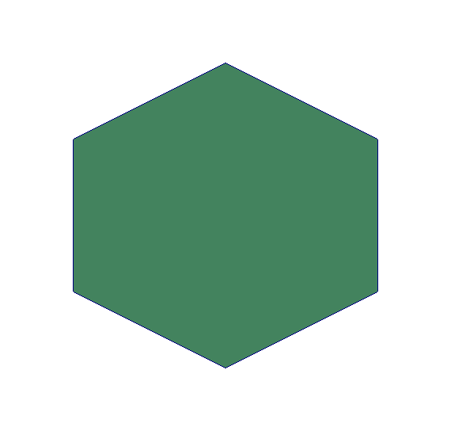
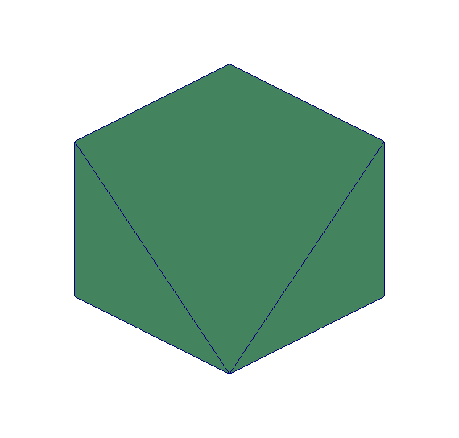

# GConverter

CAD library to operate with 3D geometries.

## Properties

`GConverter` currently operates with Object files (`.obj`) and STL files (`.stl`), taking advantage of each of them to perform the following operations:

* Translate, rotate and scale Object files.
* Calculates surface, volume and if a point is inside the body for STL files.

`GConverter` allows the conversion from Object files into STL (`.obj -> .stl`).

## Instalation

Make sure to have installed `cmake` and a C++ compiler (tested with the GNU compiler `g++`).
In the main directory folder

    mkdir build
    cd build
    cmake ..
    make

To test if all has worked fine run the tested by doing

    ctest [-V]

The `-V` option if to see the output tests.

## Examples

In the `test` folder there are different examples that uses the all the functionalities of `GConverter` library.

For the `geometries/poligon.obj`

