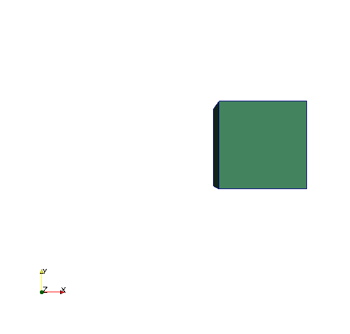
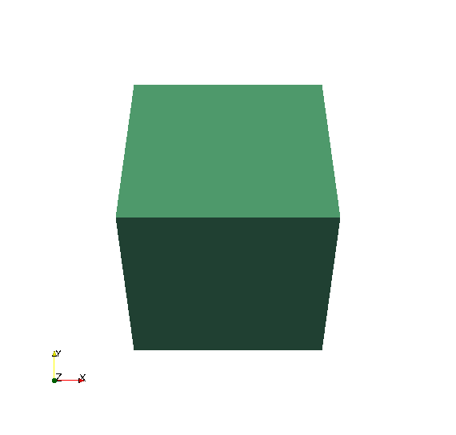
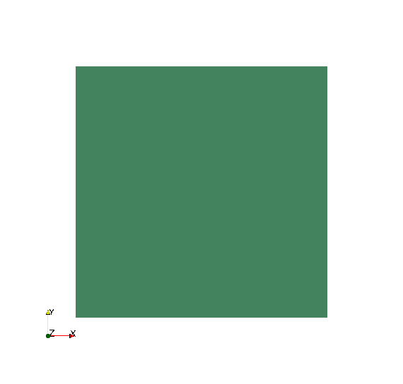

# GConverter

CAD library to operate with 3D geometries.

## Properties

`GConverter` currently operates with Object files (`.obj`) and STL files (`.stl`), taking advantage of each of them to perform the following operations:

* Translate, rotate and scale Object files.
* Calculates surface, volume and if a point is inside the body for STL files.

`GConverter` allows the conversion from Object files into STL (`.obj -> .stl`).

## Instalation

Make sure to have installed `cmake` and a C++ compiler (tested with the GNU compiler `g++`).
In the main directory folder

    mkdir build
    cd build
    cmake ..
    make

To test if all has worked fine run the tested by doing

    ctest [-V]

The `-V` option if to see the output tests.

## Examples

In the `test` folder there are different examples that uses the all the functionalities of `GConverter` library.

### Conversion from OBJ to STL

The geometry is `geometries/poligon.obj`

From the `build` directory after compiling do:

    ../test_conversor ../geometries/poligon.obj

The ASCII and the binary STL should be generated : `output-ascii.stl` and `output-binary.stl`. Both should be equivalent:

### Translation, Rotation and Scale operations

These operations are done only with the OBJ class objects.
The files can be print in STL applying the conversor after the operations.
The tests `test_obj_translate.cpp`, `test_obj_rotate.cpp` and `test_obj_scale.cpp` are prepared to show how to do these operations.

From the `build` directory after compiling do:

    ../test_obj_translate ../geometries/box.obj

    ../test_obj_rotate ../geometries/box.obj

    ../test_obj_scale ../geometries/box.obj

### Surface, Volume and Interior Point Check

These operations are done directly with the STL class objects.

From the `build` directory after compiling do:

**Surface**

    ./test/test_stl_calc_surface ../geometries/box.obj

Output:

    Surface : 6

**Volume**

    ./test/test_stl_calc_surface ../geometries/box.obj

Output:

    Volume : 1

**Interior Point Check**

    ./test/test_stl_is_point_inside ../geometries/box.obj

Output:

    The point :  1 0 0 is outside.
    The point :  0 0 0 is inside.
    The point :  0.5 0 0 is outside.
    The point :  0.499 0 0 is inside.
    The point :  0.499 -0.499 -0.499 is inside.
    The point :  0.499 -0.499 -0.5001 is outside.

